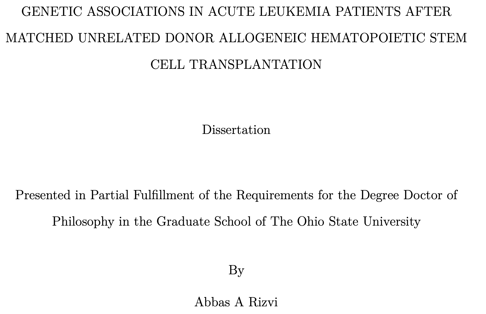
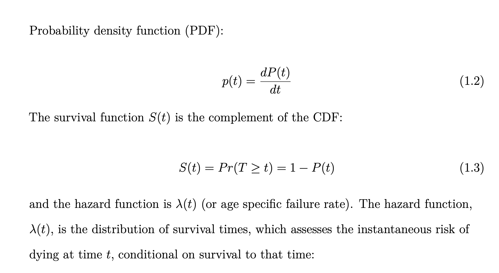
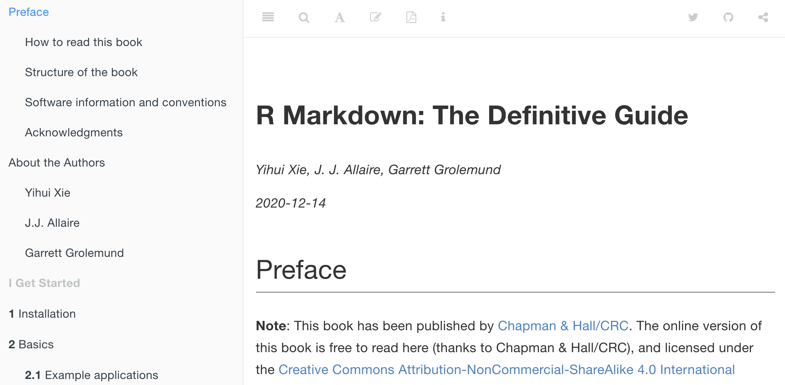
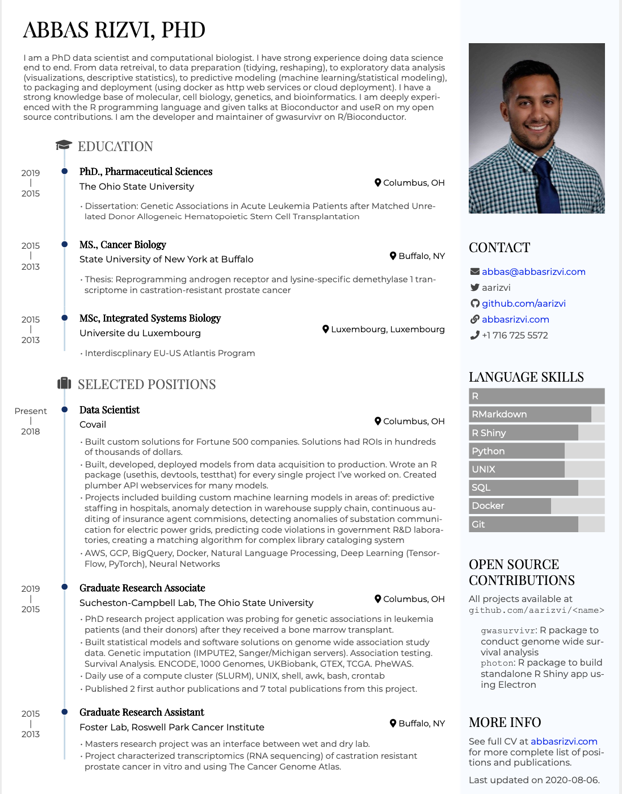
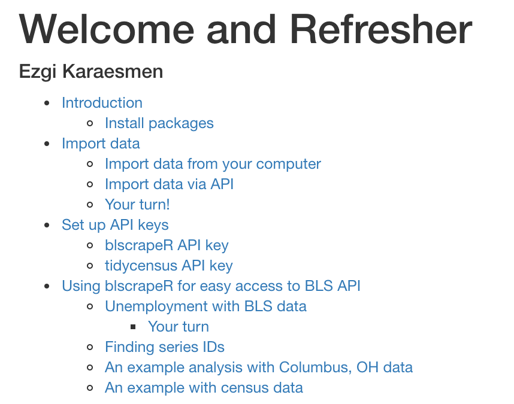
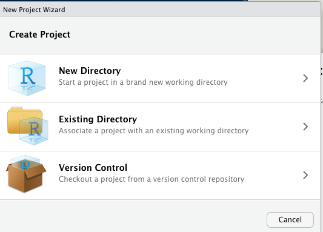

```{r xaringan-themer, include = FALSE}
library(xaringanthemer)
style_mono_accent(
  base_color = "black",
  header_font_google = google_font("Josefin Sans"),
  link_color = "deeppink",
  text_font_size = "28px",
  footnote_font_size = "22px"
)
```

```{r xaringanExtra, echo=FALSE}
xaringanExtra::use_xaringan_extra(c("tile_view", "logo", "tachyons"))
xaringanExtra::use_panelset()
xaringanExtra::use_tachyons()
```

```{r setup, include=FALSE}
options(htmltools.dir.version = FALSE)
```

# Course content

We've seen a lot of R Markdown (`.Rmd`) in these courses but have not been formally introduced to it.
R Markdown is one of the most powerful tools an analyst can have in the toolbox.  

What are we going to cover today?  

--

- What is R Markdown

- What is Markdown? And Markdown sytnax

- Why R Markdown?

- Learning about the cool capabilities of R Markdown  

- Creating your first `.Rmd` document 

---

class: center, middle

# What is R Markdown?

---

# R Markdown Introduction

Using R Markdown, one can:

1. Quickly create professional looking documents in:
  - HTML
  - PDF (need to install TinyTeX)
  - Word
1. Create notebooks in which you can run code interactively
1. Produce dashboards with flexible, interactive layouts
1. Author books
1. Generate websites and blogs
1. Create presentations (slides)

---


class: center, middle

# What can you do with R Markdown? 


---

class: center, middle

# Write academic style works



---

class: center, middle

# Write academic style works!



---

class: center, middle

# Author books



[R Markdown: The Definitive Guide](https://bookdown.org/yihui/rmarkdown/)

---

# Build websites

.pull-left[

]

.pull-right[
- build websites using [blogdown](https://bookdown.org/yihui/blogdown/) 
- create blogs using hugo and [hugodown](https://github.com/r-lib/hugodown)
]


---

# Create slides

These slides were made using R Markdown.

They are made using package `xaringan`. Documentation can be found at https://github.com/yihui/xaringan and follow the instructions.

---

# Create a data driven resume/CV!

.pull-left[

]

.pull-right[
- create [data driven resumes](http://nickstrayer.me/datadrivencv/) 
- can put your resume into a spreadsheet (Google sheets or MS Excel) and select what to add/remove in your markdown doc
- makes updating resume very convenient
]

---

class: center, middle

# How to get started?

Open a new R Markdown document in RStudio. 

---

class: center, middle

# Markdown basics

---

# Markdown 
What is Markdown?

Markdown is a markup language. It's simple to use and is intuitive.

R Markdown uses Pandoc's version of Markdown. But its easy to use! 

Let's see ...

---

# Markdown Headers

|           Markdown Syntax                 |                 Output                 |
|-------------------------------------------|----------------------------------------|
| `# Heading 1`                             |  <h1 class="smaller-h1">Heading 1</h1> |
| `## Heading 2`                            |  <h2 class="smaller-h2">Heading 2</h2> |
| `### Heading 3`                           |  <h3 class="smaller-h3">Heading 3</h3> |


header can go all that way up to six hash tags (Heading 6)

---

# Markdown Formatting Text

|           Markdown Syntax                 |  Output                          |
|-------------------------------------------|----------------------------------|
| `**Bold typography**`                     |  **Bold typography**             |
| `*Italic typography*`                     |  *Italic typography*             |
| `> block code`                            | > block code                     |

---

# Markdown Making Lists 

Ordered and unordered lists can be created.

.pull-left[
In Markdown:

```
__Ordered__:
1. Item 1
1. Item 2
1. Item 3

__Unordered__:
- Bullets
- can be made
- as well


```
]

.pull-right[
Output in your document:  

**Ordered**:
1. Item 1
2. Item 2
3. Item 3

**Unordered**:
- Bullets 
- can be made
- as well
]


---

# Markdown Insert Images

.pull-left[
 ```
 Insert an image:
 
 
 ```
]

.pull-right[
Insert an image:  

]


---

# LaTeX Math

Mathematical expression can be written using LaTeX expressions. 


You can write LaTeX math expressions inside a pair of dollar signs, e.g. &#36;\gamma+\phi$ renders $\gamma+\phi$. You can use the display style and center with double dollar signs:

If you wanted to write the mathematical expression of a sample mean (average):

```
$$\bar{X}=\frac{1}{n}\sum_{i=1}^nX_i$$
```

$$\bar{X}=\frac{1}{n}\sum_{i=1}^nX_i$$
---

class: center, middle

# R Markdown

---
# What is R Markdown

R Markdown allows us to create reproducible documents (and literate programming) that we can weave between R code and the output it produces and our narrative.

I recommend that you use RStudio with R Markdown.

You can do things like syntax highlighting, compiling code in single button, preview document.

The basic skeleton is:
* YAML header
* Markdown 
* R code chunks

---

# YAML

**YAML** -- "YAML ain't markup language". Human readable language which we used to communicate with Pandoc

This is a special section at the top of a R Markdown document. This contains instructions about your document. It controls the output document type and its appearance

It contains things like the title, author, date, and other parameters.

**Important Note** -- the indentation in the YAML is VERY important. 

```
---
title: "Intro to R"
author: "Abbas Rizvi"
date: "`r Sys.Date()`"
output:
  html_document
---
```

---

# Knit button in RStudio

'Knitting' is how you render your document. 

---

# Code chunks

Starting with ` ```{r} `  and ending with ` ``` `.


The R code chunks are processed by the package `knitr`, which is installed with `rmarkdown`

When the R Markdown file is compiled and rendered, the output of teh code chunk with be embededded in the document underneath the code.

---

# Compiling and rendering an R Markdown file

When we are ready to preview our document we can click render our document:
* Click the Knit button (or `cmd` + `shift` + `k`) in RStudio
* Call `rmarkdown::render("your_file.Rmd")` in the console

The output will be rendered and saved in the directory that the `.Rmd` file is located.

The output will be the format that your selected.

A window will pop up showing the progress of the knitting process as your document gets prepared. This is also where errors will appear that occur during the rendering process.

---
# How it works

R Markdown unifies 3 frameworks:
1. Markdown
1. `knitr` to process the R code chunks
1. YAML and pandoc to allow for the different formats

---
# Global chunk options

If you know that some options you want to apply to all of your code chunks, you can set them globally.

This can be done using `knitr::opts_chunk$set()` in the first code of the `.Rmd` file

For example, if you don't want to suppress the code throughout the entire document

```{r, eval=FALSE}
knitr::opts_chunk$set(echo=FALSE)
```

If you want to see all of the code chunks, change this to `echo=TRUE`.

---
# Chunk evaluation

The argument `eval=TRUE` evaluates a chunk.

If you do not what to evaluate the chunk set `eval=FALSE`

---
# Creating formatted tables

The `knitr` package can be used to create pretty tables

```{r, eval=FALSE}
knitr::kable(head(iris, 3))
```

```{r, echo=FALSE}
knitr::kable(head(iris, 3))
```

The table input is a `data.frame` or `tibble` or `matrix`. See `?knitr::kable` for details. Look into the package `kableExtra` as well.

---
# Inline R code

You can even put in-line code in your report. 

Will demo this live!

---
# Add Plots

You can include and format plots (graphics) in R Markdown.

Include them in an R code chunk. Plots generated by R code are placed immediately after the generating code chunk. 

During your exercise today - add a graphic!

---

# Adjust plot sizes 

You can adjust figures in your ` ```r{}  ``` ` chunk using:
1. `fig.width`
1. `fig.height`
1. `fig.align`


---

# Caching results

Code chunks can sometimes be time-consuming to run. You may consider caching it via the chunk option `cache=TRUE`

When cache is turned on - `knitr` will skip the eecution of this code chunk if this has been executed prior, and if nothing has changed.

When code modified in the chunk, `knitr` will run that code again when its rendering.

---

# Table of Contents

You can add a table of contents (TOC) using the `toc` option. 


.pull-left[
```
---
title: "Welcome and Refresher"
author: "Ezgi Karaesmen"
output: 
  html_document:
    toc: true
editor_options: 
  chunk_output_type: console
---
```
]

.pull-right[

]

---

# Best practices
Naming your chunks and organization

If you want to be organized with your R Markdown you can do the following:

`{r setup}` -- this chunk is always run

`{r library}` --- put your librarys in here

`{r functions}` --- put the functions you want to declare in this chunk.

Code chunk names:

`{r my_code_chunk_name, fig.height=4, fig.width=4}`
* name your chunk right after the `r`
* you can look at the names in your RStudio. Will demo live!

---
# Code Chunk Languages

WAIT. You can use Python and R!?!??!

`{r}` will excute R code

`{python}` will execute Python code (using reticulate).

You can do some really cool stuff here. You can move easily between R and Python.

It can be other languages too, bash, SQL.

---

# PDF 

Generating PDFs in R Markdown can create beautiful documents with 'perfect' looking typography. If you're right a report and want it to look top quality, a PDF report may be your best bet.

However, some installation is needed to render a PDF document. Importantly you need tinytex package.


---

class: center, middle

# Projects 


---
# How to create a project

.pull-left[
* Click New Project > New Project or Existing Directory
]


.pull-right[

]

---
# Benefits of projects
* Can open and close projects and return states 
* R is automatically in the proper working directory
* Switch between projects using the menu
* Open multiple RStudio sessions

---
# Projects are really convenient with Git


.pull-left[
* Create in same folder as your git repository
* Click on the create from version control option
]

.pull-right[

]


---

# Your turn! 

1. Create a new R Markdown document in RStudio
2. Save the document with a name other than "Untitled"
3. Create a header called "Introduction" (Heading 1 size)
 - write a sentence
 - make one word bold
 - make one word italics
4. Create a list
5. Add a table of contents 
6. Knit your first document as HTML

---

# THANK YOU! 

**Contact:** info@r-courses.com

Resources:
1. [R Markdown: The Definitive Guide](https://bookdown.org/yihui/rmarkdown/)
1. [R Markdown Cookbook](https://bookdown.org/yihui/rmarkdown-cookbook/)
1. [R Markdown Cheatsheet from RStudio](https://rstudio.com/wp-content/uploads/2015/02/rmarkdown-cheatsheet.pdf)
1. [R Markdown for Scientists](https://rmd4sci.njtierney.com/)
1. [R Markdown Basics Slides](https://stats.idre.ucla.edu/stat/data/rmarkdown/rmarkdown_seminar.html)
1. [What you can do with RMarkdown](https://sph-r-programming.netlify.app/)
1. [Starting RMarkdown](https://slides.djnavarro.net/starting-rmarkdown/)

